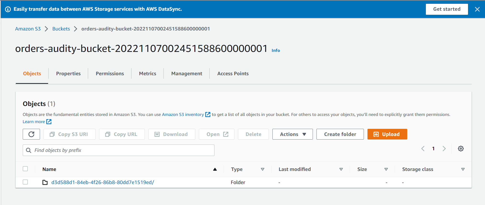

# DynamoDB

Esse hands-on tem o propósito de criar uma tabela e demonstrar as capacidades do DynamoDB.

Veremos as seguintes customizações:

- *ttl*
- *streams*
- *PITR*
- alarmes


## Pré Requisitos:

1. Instalação do terraform;
2. Configuração das credenciais aws;
3. Instalar o pacote npm serverless
  ```sh
  npm install -g serverless
  ```
4. Instalar o SAM.


## Criação do ambiente:

Inicialização do projeto terraform:

  ```sh
  terraform init
  ```

Atualize o seu nome e email nas variaveis **student_name** e **student_email**:
  
  ```sh
  variable "student_name" {
    ...
    default = "marcelo"
  }
  ...
  variable "student_email" {
    ...
    default = "tentativafc@gmail.com"
  }
  ```

Formate e valide o projeto:

  ```sh
  terraform fmt && terraform validate
  ```

Criação da infraestrutura:

  ```sh
  terraform apply --auto-approve
  ```

Criaremos alguns alarmes, sendo necessária a confirmação de subscrição conforme exemplo abaixo:

  

## Operações:

- Put Item:

  ```sh
  aws dynamodb --region us-east-1 put-item \
      --table-name OrdersMarcelo \
      --item file://data/order.json \
      --return-consumed-capacity TOTAL \
      --return-item-collection-metrics SIZE
  ```

- Get Item:

  ```sh
  aws dynamodb --region us-east-1 get-item \
      --table-name OrdersMarcelo \
      --key file://data/key.json \
      --return-consumed-capacity TOTAL
  ```

- Update Item:

  ```sh
  aws dynamodb --region us-east-1 update-item \
      --table-name OrdersMarcelo \
      --key file://data/key.json \
      --update-expression "SET #P = :p" \
      --expression-attribute-names file://data/expression-attribute-names.json \
      --expression-attribute-values file://data/expression-attribute-values.json  \
      --return-values ALL_NEW \
      --return-consumed-capacity TOTAL \
      --return-item-collection-metrics SIZE
  ```

- Delete Item:

  ```sh
  aws dynamodb --region us-east-1 delete-item \
    --table-name OrdersMarcelo \
    --key file://data/key.json \
    --return-values ALL_OLD \
    --return-consumed-capacity TOTAL \
    --return-item-collection-metrics SIZE
  ```

## Teste de Alarmes

Nos arquivos abaixo, altere para o nome da sua tabela e execute os comandos para popular a tabela:

    ```sh
    aws dynamodb --region us-east-1 batch-write-item \
      --request-items=file://data/orders1.json

    aws dynamodb --region us-east-1 batch-write-item \
      --request-items=file://data/orders2.json  
    
    aws dynamodb --region us-east-1 batch-write-item \
      --request-items=file://data/orders3.json 
    
    aws dynamodb --region us-east-1 batch-write-item \
      --request-items=file://data/orders3.json  
    ```

Testando alarmes manualmente:

```sh
# Read Alarm
aws cloudwatch --region us-east-1 set-alarm-state --alarm-name \
  dynamodb-orders-throttling-read-Marcelo --state-reason "testing" \
  --state-value ALARM

aws cloudwatch --region us-east-1 set-alarm-state --alarm-name \
  dynamodb-orders-throttling-read-Marcelo --state-reason "testing" \
  --state-value OK

# Read Alarm
aws cloudwatch --region us-east-1 set-alarm-state --alarm-name \
  dynamodb-orders-throttling-write-Marcelo --state-reason "testing" \
  --state-value ALARM

aws cloudwatch --region us-east-1 set-alarm-state --alarm-name \
  dynamodb-orders-throttling-write-Marcelo \
  --state-reason "testing" \
  --state-value OK
```

# Hands-On Streams

1. Habilite os streams na receita de terraform;
1. Obtenha o nome do bucket de auditoria, e o arn do dynamodb streams. Ele é exibido no output da execução do terraform;
    ```sh
    terraform output
    ```
1. Caso escolha SAM, siga os passos:
    1. Altere o arquivo **template.yaml** da aplicação de exemplo com esse valor e compile a aplicação e faça o deploy do projeto:
    
        ```sh
        sam build
        sam deploy --guided
        ```
1. Caso escolha Serverless, siga os seguintes passos:
    1. No arquivo **config.ts**, altere os valores das variáveis do bucket de auditoria e arn do dynamo streams, e execute o comando abaixo:

        ```sh
        serverless deploy
        ```

1. Crie, altere ou remova um item e confira os logs e o bucket de auditoria.
  
