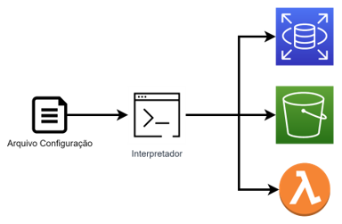
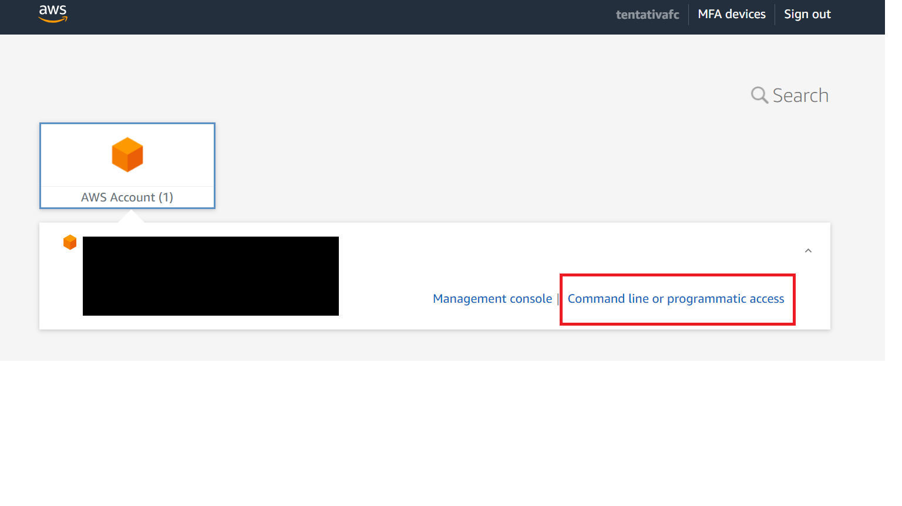
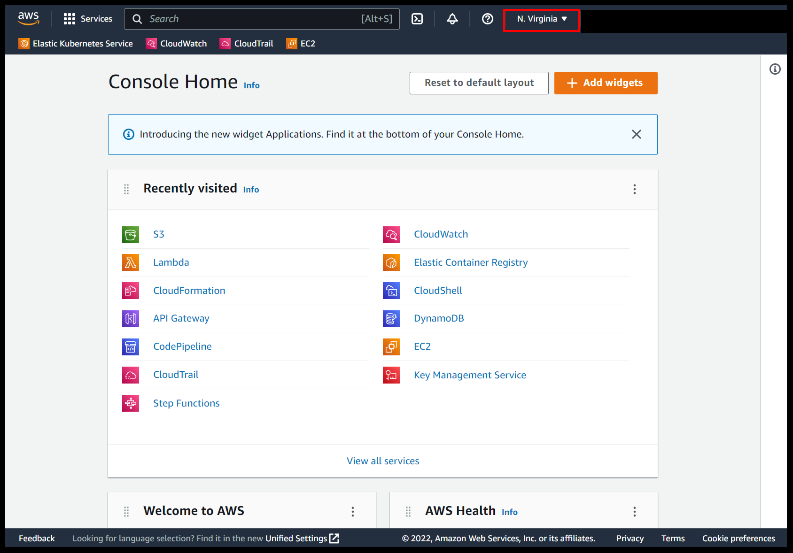
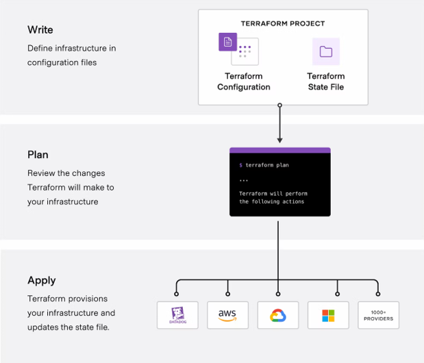
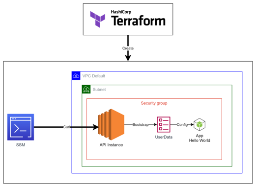

# Infraestructure as Code (IaC)

IaC é o termo dado à ferramentas de provisionamento e gerenciamento de infraestrutura através de código.

Como exemplificado na imagem abaixo, IaC utiliza-se de um arquivo chamado de **template** onde são declarados os recursos de infraestrutura que serão provisionados. Esse template é então processado resultando nos recursos físicos.




## CloudFormation

CloudFormation é o serviço IaC da AWS. Os recursos lógicos são configurados em um template. O template pode ser escrito em Json ou Yaml.

O template possui a seguinte estrutura:

```yaml
AWSTemplateFormatVersion: "version date"

Description:
  String

Parameters:
  set of parameters

Rules:
  set of rules

Mappings:
  set of mappings

Conditions:
  set of conditions

Resources:
  set of resources

Outputs:
  set of outputs
```
> AWS Docs: https://docs.aws.amazon.com/AWSCloudFormation/latest/UserGuide/template-anatomy.html

Após o template ser criado, deve-se fazer o upload em algum bucket, e então o CloudFormation utiliza esse template que possui os recursos lógicos, e cria a **Stack**.

A stack por sua vez, irá criar os recursos físicos.

### Hands-On - Criando um EC2 e um bucket S3 Web com CloudFormation (Tempo estimado 30 mins)

Esse Hands-On dará uma visão geral das principais funcionalidades do CloudFormation.

1. Logue na AWS e configure as credenciais do seu user;

    

1. Certifique-se de estar na região **us-east-1**;

    


1. Abra a documentação do CloudFormation [S3 resource](https://docs.aws.amazon.com/AWSCloudFormation/latest/UserGuide/aws-properties-s3-bucket.html).

2. Adicione as configurações necessárias para criar um bucket que tenha a configuração de site estático.

3. Valide o template:

    ```sh
    aws cloudformation validate-template --template-body file://./cloudformation/first-template.yaml
    ```

3. Ir para o serviço CloudFormation;

5. Criar a stack à partir do arquivo template;

7. Configurar o parâmetro de nome de bucket, referenciar no Resources. Note que todos os parâmetros declarados no bloco **Parameters** são solicitados;

8. Atualizar a stack sobrescrevendo o template com essa nova versão;

9. E se eu precisar que a url do bucket seja mostrado?

10. Configure o Outputs que mostre a url do Bucket, e repita o passo 8.

11. Agora eu preciso também criar uma instância ec2, e dependendo do ambiente (DEV ou PROD) eu preciso que o tipo de instância sejam diferentes. No ambiente de dev, utilizarei uma instância **t3.micro** e em prod utilizarei uma instância **t3.medium**.

12. Abra a documentação de [EC2 Instance](https://docs.aws.amazon.com/AWSCloudFormation/latest/UserGuide/aws-properties-ec2-instance.html) e [Mappings](https://docs.aws.amazon.com/AWSCloudFormation/latest/UserGuide/mappings-section-structure.html);

13. Para obter o id da imagem, liste as imagens EC2 disponíveis na region **us-east-1**.

    ```sh
    aws ec2 describe-images --owners self amazon --filters "Name=name,Values=amzn2-ami-kernel-5.10-hvm-2.0.20221103.3-x86_64-gp2"
    ```

14. Adicione as configurações de Mapping para personalizar por ambiente, e repita o passo 8.

15. Se o ambiente for **prod**, eu quero que o bucket seja mantido caso a stack seja deletada.

16. Abra a documentação de [Conditions](https://docs.aws.amazon.com/AWSCloudFormation/latest/UserGuide/conditions-section-structure.html)

16. Configure o [Deletion Policy](https://docs.aws.amazon.com/AWSCloudFormation/latest/UserGuide/aws-attribute-deletionpolicy.html) do Bucket caso o ambiente seja **prod**.

17. Ao fim do Hands-On, remova a stack.

18. O Bucket foi removido?

Fim

## Terraform

[Terraform](https://www.terraform.io/) é uma ferrramenta IaC da HashCorp. Escrevemos nossos templates na linguagem [HCL](https://developer.hashicorp.com/terraform/language/syntax/configuration), e o Terraform o interpreta, cria, e configura os recursos declarados.

Conforme exemplificado abaixo, a grande vantagem do Terraform em relação ao Cloudformation é capacidade de ser Multi-Cloud.

  

### Hands-On - Criando um S3 Bucket WebSite com Terraform (Tempo estimado 30 mins)

Objetivo desse Hands-On é provisionar um Bucket S3, passando pelos principais componentes do Terraform.

1. [Instale o Terraform](https://developer.hashicorp.com/terraform/downloads);

1. Instale a [extensão Terraform](https://marketplace.visualstudio.com/items?itemName=HashiCorp.terraform) no seu VsCode;

1. Logue na AWS e configure as credenciais do seu user;

    

1. Certifique-se de estar na região **us-east-1**;

    

1. Deixe aberto os seguintes links:
    - [Terraform Registry AWS](https://registry.terraform.io/providers/hashicorp/aws/4.43.0)
    - [Resource aws_s3_bucket](https://registry.terraform.io/providers/hashicorp/aws/latest/docs/resources/s3_bucket)

1. Vá para a pasta hands-on-s3:
    ```sh
    cd hands-on-s3
    ```

1. Edite os arquivos de acordo com os comentários.

1. Preparar o diretório para os comandos Terraform:
    ```sh
    terraform init
    ```
1. Validar as configurações dos templates:
    ```sh
    terraform validate
    ```
1. Formate os templates:
    ```sh
    terraform validate
    ```
1. Veja o plano de execução:
    ```sh
    terraform plan
    ```
1. Crie ou atualize a infrastrutura:
    ```sh
    terraform apply
    ```
1. Ao final, destrua a infraestrutura:
    ```sh
    terraform destroy
    ```

Fim

### Hands-On EC2 + API Node (Tempo estimado 60 mins)

Esse Hands-On tem o objetivo de provisionar uma instância EC2 com um API Nodejs respondendo "Hello World".

Algumas das configurações já estâo prontas para melhorar o desenrolar da atividade.

### Arquitetura:

O que faremos:



1. Provisionaremos toda a camada de segurança com as configurções de IAM e Security Group;
2. Consultaremos a imagem oficial da Amazon a nossa instância EC2;
3. Provisionaremos nossa Instância com as configurações:
  - Atualização dos pacotes linux;
  - Instalação do NVM e Node;
  - Construção de um arquivo com o código do servidor (index.js)
  - Start da nossa aplicação em background;
4. Por último entraremos na instância EC2 via SSM e faremos alguns testes de curl.
