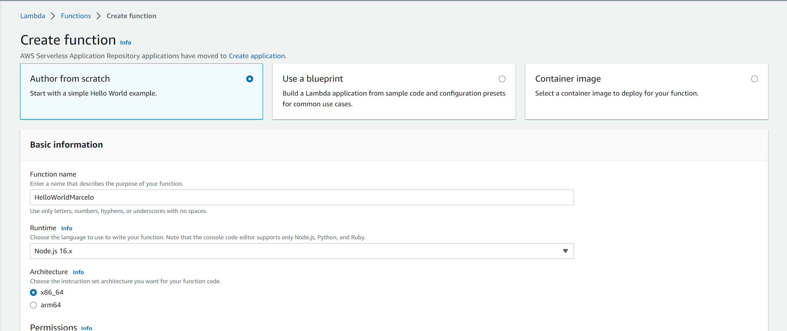
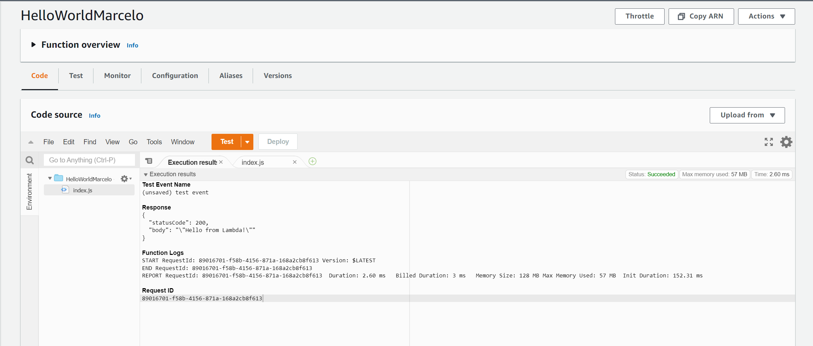
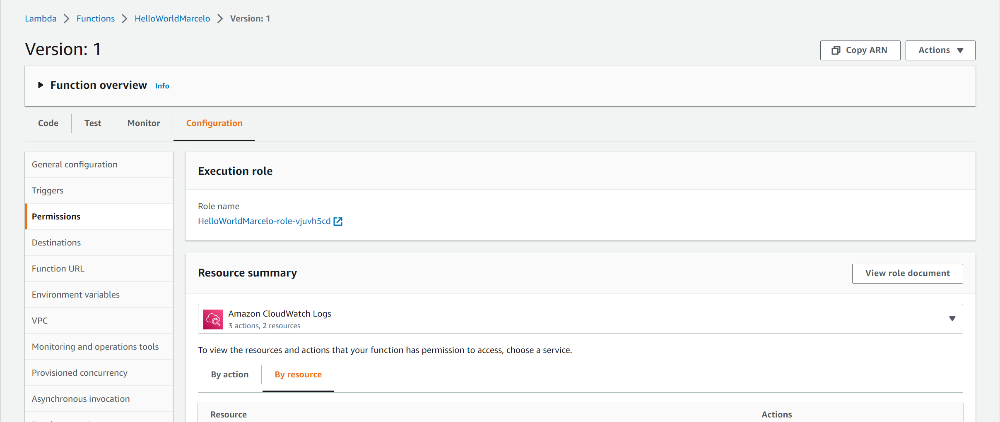
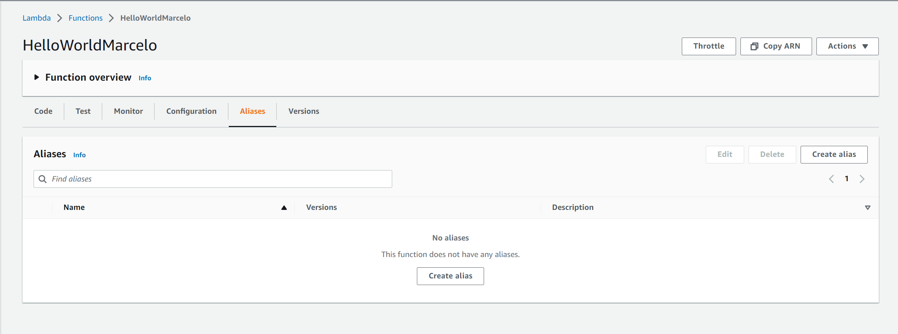

# Lambda

Este repositório contém todo o conteúdo de apoio para as aulas de Lambda.

## Hands On - Visão Geral (Tempo Estimado 20 mins)

Esse Hands-on dará uma visão geral do produto AWS Lambda.

1. Faça login na AWS;
2. Certifique-se de estar na região **us-east-1**;
    
    
3. Vá para o serviço Lambda;
4. Crie uma função chamada **HelloWorld\<Nome Aluno\>**; runtime **Node.js 16.x**; e arquitetura **x86_64**;
    
    
5. Teste uma chamada;

6. Verifique as informações log.

    

Fim.

## Hands On - Version e Alias (Tempo Estimado 40 mins)

Os tipos de deploy Blue-Green e Canário, são ótimas estratégias para mitigar erros que ocorrem em novas versões de software.

As features **Version** e **Alias** são ótimas features para controlar o código que está disponível para ser executado. 

Esse Hands-On mostrará como é feito um deploy Blue-Green utilizando essas duas features. 

1. Faça login na AWS;
2. Certifique-se de estar na região **us-east-1**;
    
    
3. Vá para o serviço Lambda;
4. Na própria função criada anteriormente, publique a versão atual. Lembrando que versão é imutável.

    
5. Verifique a ARN e também se é possível editar o código;
    
    

6. Crie um Alias chamado BlueGreen e aponte para essa Versão;
    
    

7. Faça alguns testes chamando a Lamdba através do comando abaixo:
    
    ```sh
    aws lambda invoke \
        --function-name HelloWorldMarcelo:BlueGreen \
        --payload '{}' \
        response.json && cat response.json
    ```

8. Altere o código para receber o nome no input:
   
    ```js
    exports.handler = async (event, context) => {
        
        console.log("Event: ",JSON.stringify(event));
        console.log("Context: ", JSON.stringify(context));
        
        const response = {
            statusCode: 200,
            body: JSON.stringify(`Hello ${event.name}`),
        };
        
        return response;
    };
    ```
9. Faça deploy e execute o teste novamente para certificar que tudo está correto:
    
    ```sh
    aws lambda invoke \
        --function-name HelloWorldMarcelo \
        --payload '{"name": "Marcelo"}' \
        response.json && cat response.json
    ```

10. Agora vamos testar o deploy BlueGreen. Para isso, publique uma nova versão e edite o Alias BlueGreen para direcionar 50% de tráfego para a nova versão:

    

11. Teste novamente. Repita o comando, e veja que as duas versões estão recebendo requisições:

    ```sh
    aws lambda invoke \
        --function-name HelloWorldMarcelo:BlueGreen \
        --payload '{"name": "Marcelo"}' \
        response.json && cat response.json
    ```

Fim.


## SAM

O AWS Serverless Application Model(AWS SAM) é uma estrutura de código aberto que você pode usar para criar aplicações serverless na AWS.

Você pode usar o AWS SAM Para definir aplicativos sem servidor. AWS SAM consiste nos seguintes componentes:

- AWS SAM especificação do modelo. Você usa essa especificação para definir seu aplicativo serverless. O fornece uma sintaxe simples e limpa para descrever funções, APIs, permissões, configurações e eventos que compõem uma aplicação sem servidor. Você usa um arquivo de modelo para operar em uma única entidade implantável e versionada que é seu aplicativo sem servidor.
- AWS SAM Interface da linha de comando do (AWS SAMCLI). Você usa essa ferramenta para criar aplicativos serverless definidos na especificação. A CLI fornece comandos que permitem verificar se os arquivos de modelo são gravados de acordo com a especificação, invocam funções do Lambda localmente, depurar funções do Lambda, empacotar e implantar aplicativos serverless na AWS e assim por diante.

> AWS Docs: https://docs.aws.amazon.com/serverless-application-model/latest/developerguide/what-is-sam.html


### Hands On (Tempo estimado 1 hora)

1. Instalação do AWS CLI:

    Siga o passo a passo:

    - Windows: https://docs.aws.amazon.com/pt_br/serverless-application-model/latest/developerguide/serverless-sam-cli-install-windows.html
    - Linux: https://docs.aws.amazon.com/pt_br/serverless-application-model/latest/developerguide/serverless-sam-cli-install-linux.html

2. Instalação da extensão AWS Toolkit para o VSCode

    Siga o passo a passo: 
    - https://docs.aws.amazon.com/toolkit-for-vscode/latest/userguide/setup-toolkit.html


3. Criação do projeto:

    ```sh
    sam init
    ```

    Siga o passo a passo.

4. Comandos básicos:

    Validação do projeto

    ```sh
    sam validate
    ```

    Teste da API:

    ```sh
    curl http://localhost:8080/hello
    ```

5. Configuração de debug no visual code

    ```json
    // Code
    {
        "type": "aws-sam",
        "request": "direct-invoke",
        "name": "Hello World Lambda",
        "invokeTarget": {
            "target": "code",
            "projectRoot": "hello-world",
            "lambdaHandler": "app.lambdaHandler"
        },
        "lambda": {
            "runtime": "nodejs16.x",
            "payload": {},
            "environmentVariables": {}
        }
    }

    // API
    {
        "type": "aws-sam",
        "request": "direct-invoke",
        "name": "Hello World API Lambda",
        "invokeTarget": {
        "target": "api",
        "templatePath": "hello-world-marcelo/template.yaml",
        "logicalId": "HelloWorldFunction"
        },
        "api": {
        "path": "/hello",
        "httpMethod": "get",
        "payload": {
            "json": {}
        },
        "querystring": "name=Marcelo",
        "headers": {
            "cookie": "name=value; name2=value2; name3=value3"
        }
        },
        "sam": {},
        "aws": {}
    }
    ```

6. Faça o deploy da aplicação

    ```sh
    sam deploy --guided
    ```

    Ao efetuar o deploy, verifique os serviços CloudFormation, S3, API Gateway. 

8. Verifique os logs e traces

    Logs
    ```sh
    sam logs --stack-name <stackname> --tail --include-traces
    ```

    Traces

    ```sh
    sam traces --tail
    ```

Fim.