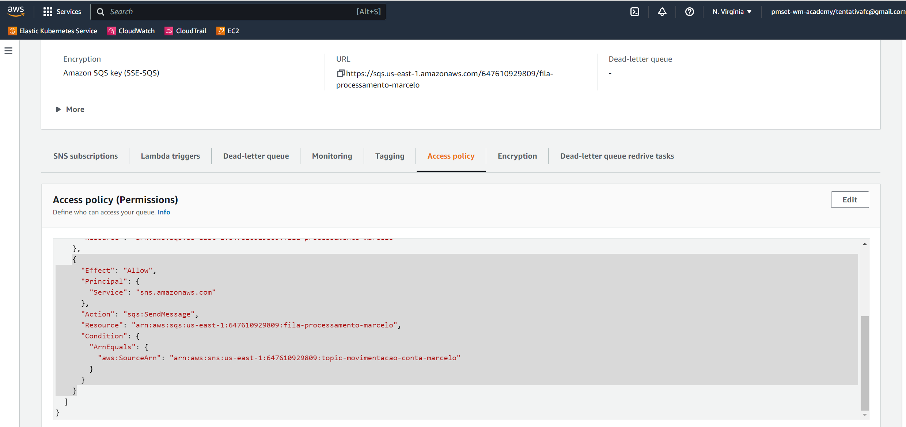

# Serverless

Este repositório contém todo o conteúdo de apoio para as aulas de Serverless.

## Hands On - Visão Geral Lambda (Tempo Estimado 20 mins)

Esse Hands-on dará uma visão geral do produto AWS Lambda.

1. Faça login na AWS;
2. Certifique-se de estar na região **us-east-1**;
    
    
3. Vá para o serviço Lambda;
4. Crie uma função chamada **HelloWorld\<Nome Aluno\>**; runtime **Node.js 16.x**; e arquitetura **x86_64**;
    
    
5. Teste uma chamada;

6. Verifique as informações log.

    

7. Coloque um delay dentro da função **handler**. Esse dalay simula uma obtenção de conexão com o banco, ou uma leitura de arquivos de configuração;
    ```js
    function delay(milliseconds) {
        return new Promise(resolve => {
            setTimeout(resolve, milliseconds);
        });
    }
    ```

8. O que aconteceu?

9. Agora refatore o código e coloque o delay no bloco de inicialização.

10. Os tempos melhoraram ou pioraram. Por quê?

Fim.

## Hands On - Canary Lambda e Canary API Gateway (Tempo Estimado 60 mins)

Os tipos de deploy Blue-Green e Canário, são ótimas estratégias para mitigar erros que ocorrem em novas versões de software.

Essa estratégia de deploy funciona da seguinte maneira:

As features **Version** e **Alias** são ótimas features para controlar o código que está disponível para ser executado. 

Esse Hands-On mostrará como é feito um deploy Blue-Green utilizando essas duas features. 

1. Faça login na AWS;
1. Certifique-se de estar na região **us-east-1**;
    
    

1. Vá para o serviço Lambda;
1. Na própria função criada anteriormente, edite o código e acrescente a versão:

    ```js
    exports.handler = async (event) => {
        console.log(`Event: ${JSON.stringify(event)}`);
        
        const response = {
            statusCode: 200,
            body: JSON.stringify('Hello from Lambda! V1'),
        };
        return response;
    };
    ```

1. Publique a versão atual. Lembrando que versão é imutável.

    
1. Verifique a ARN e também se é possível editar o código;
    
    

1. Crie um Alias chamado BlueGreen e aponte para essa Versão;
    
    

1. Faça alguns testes chamando a lamdba através do comando abaixo:
    
    ```sh
    aws lambda invoke \
        --function-name HelloWorldMarcelo:BlueGreen \
        --payload '{}' \
        response.json && cat response.json
    ```

1. Altere novamente o código alterando a versão:
   
    ```js
    exports.handler = async (event) => {
        console.log(`Event: ${JSON.stringify(event)}`);
        
        const response = {
            statusCode: 200,
            body: JSON.stringify('Hello from Lambda! V2'),
        };
        return response;
    };
    ```

1. Faça deploy e execute o teste novamente para certificar que tudo está correto:
    
    ```sh
    aws lambda invoke \
        --function-name HelloWorldMarcelo \
        --payload '{}' \
        response.json && cat response.json
    ```

1. Agora vamos testar o deploy BlueGreen. Para isso, publique uma nova versão e edite o Alias BlueGreen para direcionar 50% de tráfego para a nova versão:

    

1. Teste novamente. Repita o comando, e veja que as duas versões estão recebendo requisições:

    ```sh
    aws lambda invoke \
        --function-name HelloWorldMarcelo:BlueGreen \
        --payload '{}' \
        response.json && cat response.json
    ```

1. Agora vamos configurar o deploy canário no **API Gateway**, mas antes, crie dois alias um para a versão 1 chamado **blue**, e um para versão 2 chamado **green**;

1. Vá para o serviço de API Gateway;

1. Na seção REST API, clique em build;
     

    > Obs: Diferenças entre HTTP API e Rest API são descritas [aqui](https://docs.aws.amazon.com/apigateway/latest/developerguide/http-api-vs-rest.html);

1. Na seção **Protocol**, selecione **REST**, selecione **New API**, dê um **nome** para a API, selecione o tipo de endpoint **Regional** e clique em **Create API**;
    

1. Em **Actions** crie um novo recurso chamado **hello-world**;

1. Crie um método **GET**;

1. Em **Integration Type** selecione **Lambda**, clique em **Use Lambda Proxy Integration**, e por fim coloque a ARN da sua lambda com o alias dinâmico **HelloWorldMarcelo:${stageVariables.alias}**;
    

1. Agora em **Actions** faça o deploy da API;

    

1. Selecione o stage e crie uma stage variable chamada **alias** com o valor **blue**;

    

1. Por fim, crie um canary deploy com **Overide Value* configurado com o valor **green**;

    

1. Faça algumas chamadas e verifique o que aconteceu:

    ```sh
    curl -k -v https://2d606jh5nf.execute-api.us-east-1.amazonaws.com/prod/hello-world
    ```

Fim.

## Hands On - SNS e SQS (Tempo estimado 60 mins)

Neste Hands On veremos um ecosistema serverless. Utilizaremos API Gateway, Lambda, SNS e SQS.

  

1. Faça login na AWS;
1. Certifique-se de estar na região **us-east-1**;
    
    
    

1. Primeiramente, vamos criar os nossos tópicos SNS. Para isso vá no serviço SNS, e crie dois tópicos de acordo com o desenho de arquitetura:

    - Tópico **topic-movimentacao-conta-nome-aluno** - Tópico que receberá eventos de transferência de valores através de Lambda.
    - Tópico **topic-notificacao-cliente-nome-aluno** - Tópico que notificará o cliente que o valor está saindo da conta.

    ![Tópicos]](images/sns-topics.png "Tópicos")

1. Agora vá para o serviço de SQS e crie a fila de processamento. Essa fila receberá o evento do SNS.

    - Fila **fila-processamento-marcelo-nome-aluno** - Tópico que receberá eventos de transferência de valores através de Lambda.

    

1. Agora a fila precisa sobrescrever o tópico **topic-movimentacao-conta-nome-aluno**, e também precisamos criar uma subscrição no tópico **topic-notificacao-cliente-nome-aluno** para recebermos os emails de notificação.

1. Através da subscrição, o SNS precisará de permissão de escrita na fila. Precisamos portanto adicionar um statement de permissão do SNS no resource policy da Fila

    ```json
    {
      "Effect": "Allow",
      "Principal": {
        "Service": "sns.amazonaws.com"
      },
      "Action": "sqs:SendMessage",
      "Resource": "<ARN DA FILA>",
      "Condition": {
        "ArnEquals": {
          "aws:SourceArn": "<ARN DO TOPICO>"
        }
      }
    }
    ```

    

1. Vamos evoluir agora as nossas duas lambdas. Obs: Ao criar a lambda, atributa a role **lambda-fiap-default**;

1. O nome dessa lambda será **api-transferencia-nome-aluno**. Ela receberá o post do API Gateway. Obteremos o payload com o **valor**, **conta de origem** e **conta de destino**. A responsabilidade desta lambda é repassar esse evento para o tópico SNS. Note pelo código abaixo que precisaremos configurar a ARN do tópico. Para isso utilizaremos as variáveis de ambiente.

    ```js
    var AWS = require('aws-sdk');
    AWS.config.update({region: 'us-east-1'});
    exports.handler = async (event) => {
        console.log(JSON.stringify(event));
        
        var params = {
        Message: event.body,
        TopicArn: process.env.TOPIC_MOVIMENTACAO_CONTA
        };
        
        const data = await new AWS.SNS({apiVersion: '2010-03-31'}).publish(params).promise();
        console.log("MessageID is " + data.MessageId);
        
        const response = {
            statusCode: 200,
            body: JSON.stringify('Transferência recebida.'),
        };
        return response;
    };
    ```

1. A segunda lambda receberá o evento do SNS, formatará uma mensagem e publicará no tópico **topic-notificacao-cliente-nome-aluno**. Atribua o nome de **event-processamento-transferencia-nome-aluno**
     ```js
    var AWS = require('aws-sdk');
    AWS.config.update({region: 'us-east-1'});

    exports.handler = async (event) => {
        console.log(`Event: ${JSON.stringify(event)}`);
        console.log(event.Records.length);
        for (const rec of event.Records) {
        
            const transactionDocument = JSON.parse(rec.body);
            const notificationMessage = `Valor ${transactionDocument.amount} saindo da conta de ${transactionDocument.user_from}, e indo para a conta ${transactionDocument.user_to}`;
        
            var params = {
            Message: notificationMessage,
            TopicArn: process.env.TOPIC_NOTIFICACAO_CLIENTE
            };
            
            const data = await new AWS.SNS({apiVersion: '2010-03-31'}).publish(params).promise();
            console.log("MessageID is " + data.MessageId);
            
        };
        return true;
    };
    ``` 

1. Vamos criar o no nosso API Gateway com o nome de **transferencia-nome-aluno**. Configure um resource chamado **/transferencias** com method **POST**.

    

1. Para testar, utilize o comando abaixo:

    ```sh
    curl --location --request POST 'https://<id-gateway>.execute-api.us-east-1.amazonaws.com/<nome-stage>/transferencia' \
    --header 'Content-Type: application/json' \
    --data-raw '{
        "user_from": "marcelo",
        "user_to": "andre",
        "amount": 200.0
    }'
    ```
1. Por fim, vamos testar a resiliência. Para isso vamos configurar uma fila DLQ para receber processamentos com erro.


## SAM

O AWS Serverless Application Model(AWS SAM) é uma estrutura de código aberto que você pode usar para criar aplicações serverless na AWS.

Você pode usar o AWS SAM Para definir aplicativos sem servidor. AWS SAM consiste nos seguintes componentes:

- AWS SAM especificação do modelo. Você usa essa especificação para definir seu aplicativo serverless. O fornece uma sintaxe simples e limpa para descrever funções, APIs, permissões, configurações e eventos que compõem uma aplicação sem servidor. Você usa um arquivo de modelo para operar em uma única entidade implantável e versionada que é seu aplicativo sem servidor.
- AWS SAM Interface da linha de comando do (AWS SAMCLI). Você usa essa ferramenta para criar aplicativos serverless definidos na especificação. A CLI fornece comandos que permitem verificar se os arquivos de modelo são gravados de acordo com a especificação, invocam funções do Lambda localmente, depurar funções do Lambda, empacotar e implantar aplicativos serverless na AWS e assim por diante.

> AWS Docs: https://docs.aws.amazon.com/serverless-application-model/latest/developerguide/what-is-sam.html


### Hands On (Tempo estimado 1 hora)

1. Instalação do AWS CLI:

    Siga o passo a passo:

    - Windows: https://docs.aws.amazon.com/pt_br/serverless-application-model/latest/developerguide/serverless-sam-cli-install-windows.html
    - Linux: https://docs.aws.amazon.com/pt_br/serverless-application-model/latest/developerguide/serverless-sam-cli-install-linux.html

2. Instalação da extensão AWS Toolkit para o VSCode

    Siga o passo a passo: 
    - https://docs.aws.amazon.com/toolkit-for-vscode/latest/userguide/setup-toolkit.html


3. Criação do projeto:

    ```sh
    sam init
    ```

    Siga o passo a passo.

4. Comandos básicos:

    Validação do projeto

    ```sh
    sam validate
    ```

    Teste da API:

    ```sh
    curl http://localhost:8080/hello
    ```

5. Configuração de debug no visual code

    ```json
    // Code
    {
        "type": "aws-sam",
        "request": "direct-invoke",
        "name": "Hello World Lambda",
        "invokeTarget": {
            "target": "code",
            "projectRoot": "hello-world",
            "lambdaHandler": "app.lambdaHandler"
        },
        "lambda": {
            "runtime": "nodejs16.x",
            "payload": {},
            "environmentVariables": {}
        }
    }

    // API
    {
        "type": "aws-sam",
        "request": "direct-invoke",
        "name": "Hello World API Lambda",
        "invokeTarget": {
        "target": "api",
        "templatePath": "hello-world-marcelo/template.yaml",
        "logicalId": "HelloWorldFunction"
        },
        "api": {
        "path": "/hello",
        "httpMethod": "get",
        "payload": {
            "json": {}
        },
        "querystring": "name=Marcelo",
        "headers": {
            "cookie": "name=value; name2=value2; name3=value3"
        }
        },
        "sam": {},
        "aws": {}
    }
    ```

6. Faça o deploy da aplicação

    ```sh
    sam deploy --guided
    ```

    Ao efetuar o deploy, verifique os serviços CloudFormation, S3, API Gateway. 

8. Verifique os logs e traces

    Logs
    ```sh
    sam logs --stack-name <stackname> --tail --include-traces
    ```

    Traces

    ```sh
    sam traces --tail
    ```

Fim.
