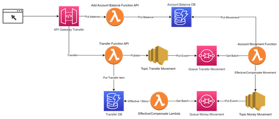
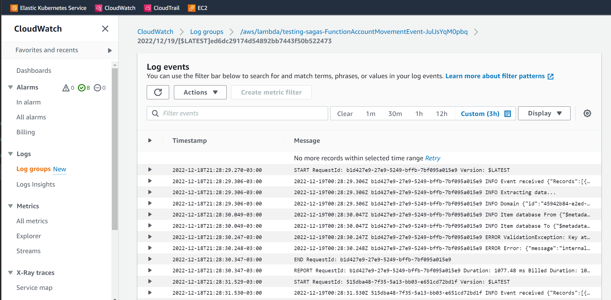
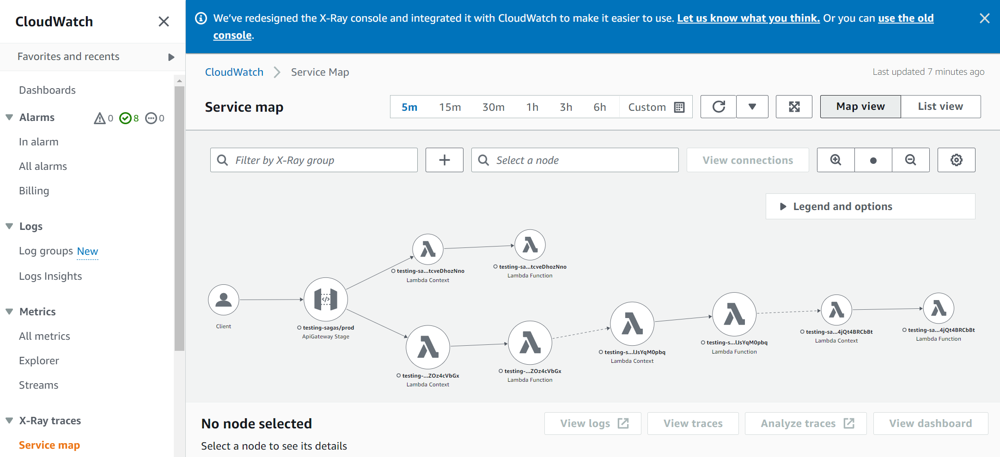

# Troubleshootings

O objetivo desta aula é dar um case com alguns problemas de configuração e execução, de forma que o aluno consiga analisar e corrigir.

## Problema

Estamos desenvolvendo uma aplicação de transferência bancária que consiste em **enviar uma quantia de dinheiro** de uma **conta origem** para uma **conta destino**. A arquitetura da aplicação é demonstrada na imagem abaixo:



Ocorre que a squad atual que desenvolveu essa aplicação ganharam um bolão da Mega Sena e não trabalham mais no projeto. Você foi contratado para continuar o desenvolvimento e identificar possíveis problemas.

## Processo

1. Identifique se o template do SAM é válido, e caso não seja, corrija:
    ```sh
    sam validate
    ```
1. No template SAM, altere o parâmetro de **StudentName**; 

1. Faça o build das aplicações com o comando:
    ```sh
    sam build
    ```

1. Faça o deploy da aplicação:
    ```sh
    sam deploy --guided --capabilities CAPABILITY_NAMED_IAM
    ```

## Análise e Troubleshooting

1. Análise de logs do sam, pois pode haver erros na configuração da aplicação e Cloudformation.

1. Analise os logs CloudWatch. O CloudWatch Log insigts nos dá o detalhe dos logs da aplicação de forma que possamos identificar se ocorreu um erro no código. A aplicação está com uma quantidade razoável de logs.

    

1. Verifique os traces do X-Ray. X-Ray é o serviço da AWS que é responsável por fazer o trace da aplicação. Nos ajudará a identificar em qual ponto da arquitetura, não há propagação de eventos. Indicará que aquela peça está com problema, ou que os dados estão incorretos.

    
